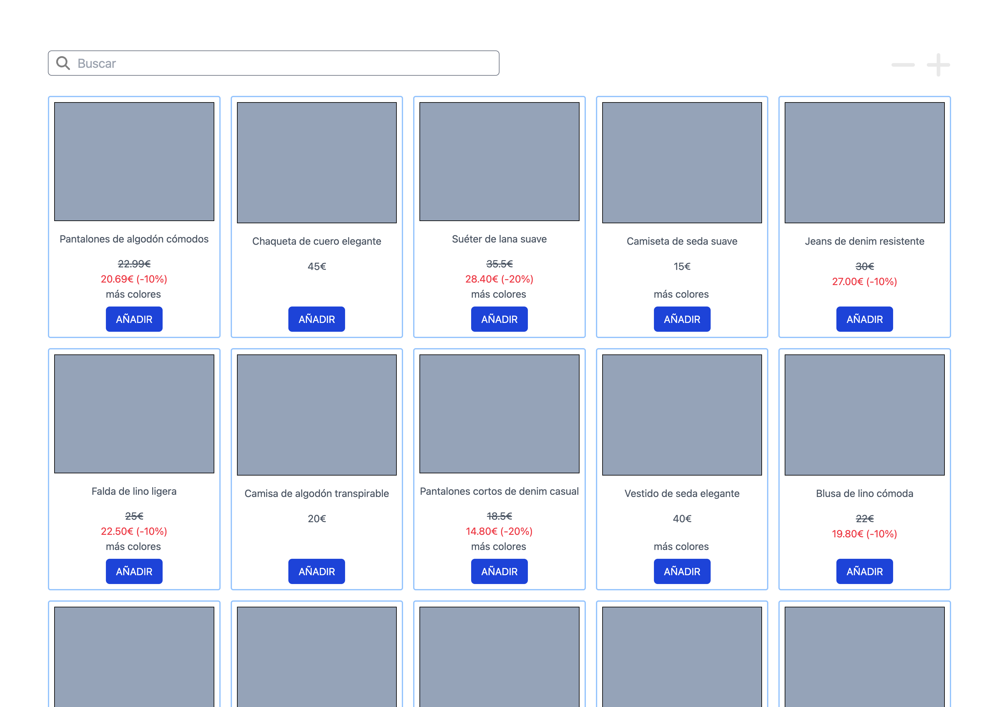
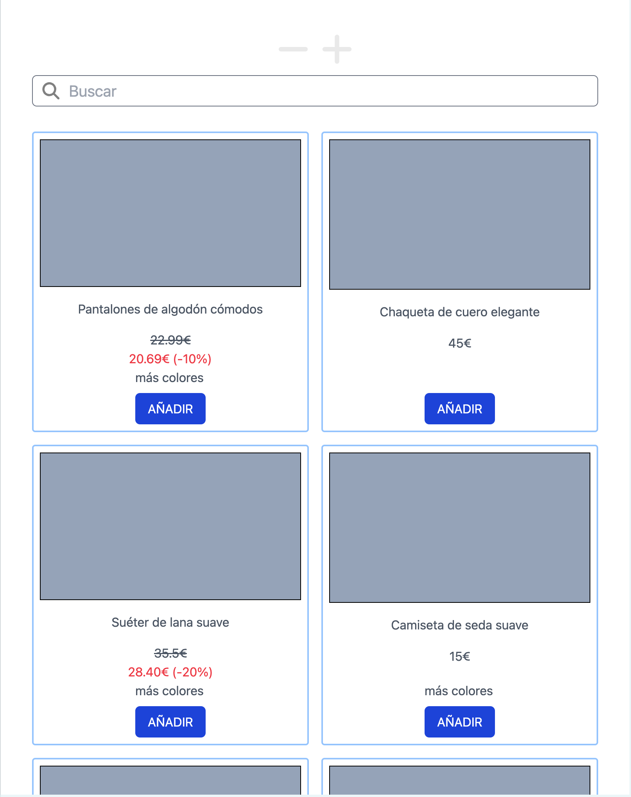

# Proyecto en respuesta a Mayoral Frontend Assignment

Se incluye una única página SSR e interactiva en cliente para filtros y orden por precios.

La página es responsive y se ve bien desde pantallas muy grandes a muy pequeñas.

Primero, instalar dependencias.
`npm i`

Ejecutar en modo dev
`npm run dev`

Generar build
`npm run build`

Navegar por la build
`npm run start`

La única página se genera en modo SSG al hacer la build.

__NOTA:__ se han encontrado errores en el archivo tsconfig.json (menciones a Graphql). Las importaciones desde rutas absolutas no funcionan en el entorno de test así que se han cambiado todas a ruta relativa.
